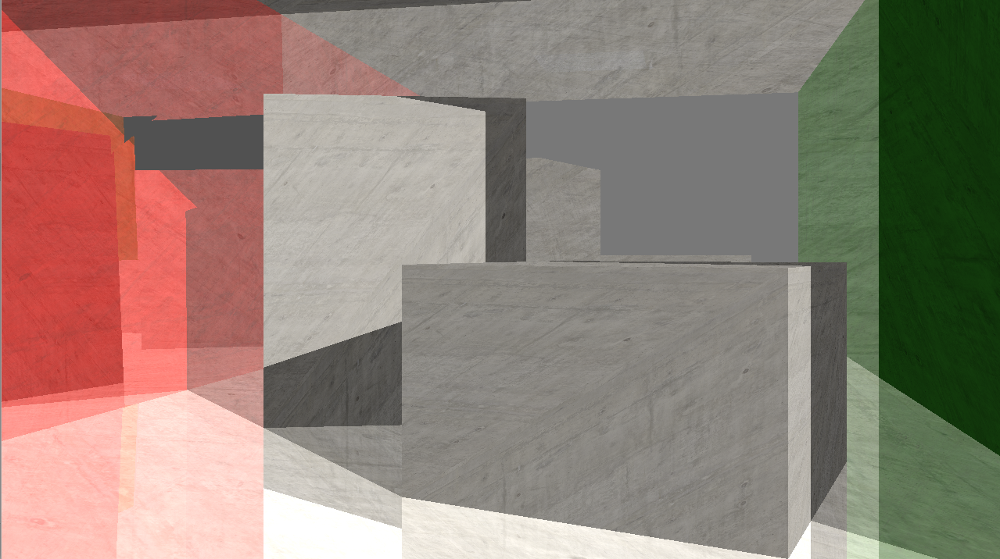
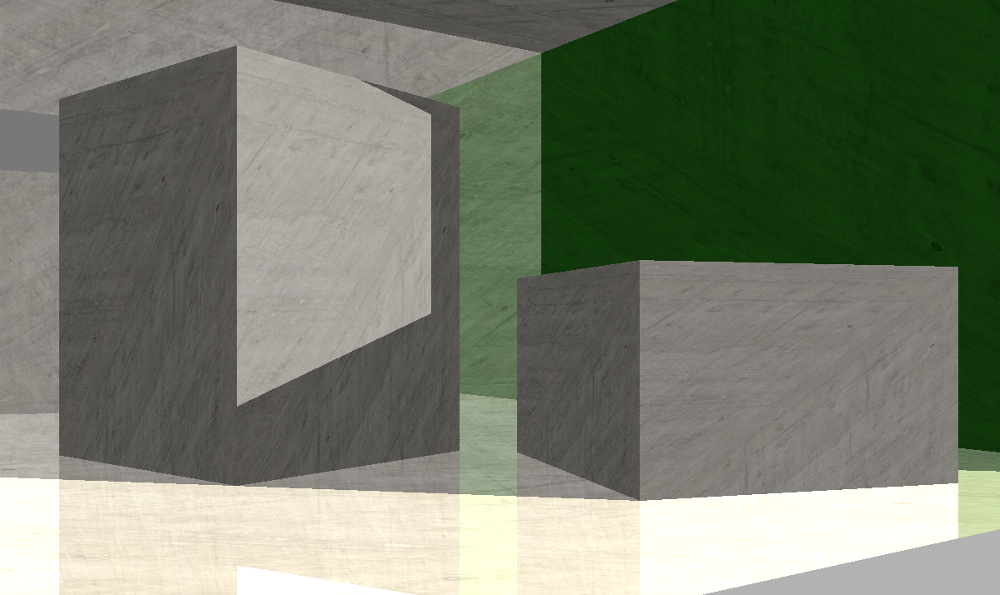
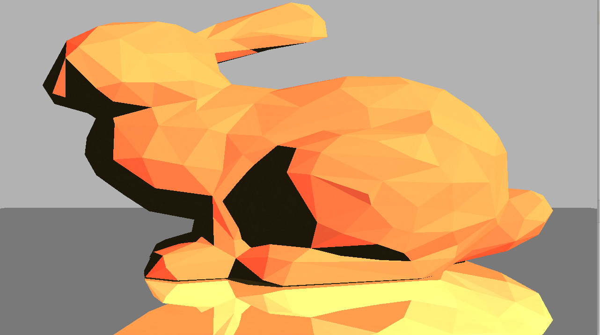

#### Fox-Tracer v.0.7.

This is an OpenGL based, real-time ray tracer for visualizing 3D polygon meshes loaded from OBJ files.

#### Used technologies :
- C++
- OpenGL and GLSL shading language
- GLEW, GLFW libraries
- Assimp library for loading OBJ files
- Shader storage buffers

The performance was optimized with bounding volume hierachies (BVH-tree), meaning that the bounding boxes are divided along the longest axis. The longest axis
is always placed on the average centroid of the polygons. The whole tree is stored in a plain array and sent to a shader storage buffer in the fragment shader.
The traversal is taken place in the fragment shader and the contstruction of BVH-tree is on the CPU side.

#### Features, capabilities:
- BVH-tree acceleration
- Total reflection
- Diffuse light
- Phong-Blinn shading
- Ambient Light
- Möller-Trumbore ray-triangle intersection algorithm
- Textures

#### Required libraries:
- Assimp 5.0.1
- GLFW 3.3.2
- GLEW 2.1.0
- CMake 3.17

#### Some screenshots from the application:

  
   
  
   
  

